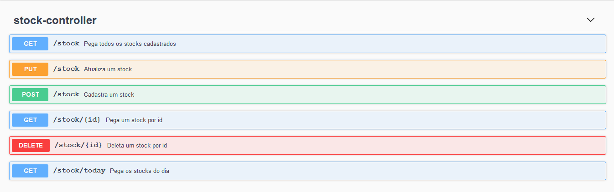

# Bootcamp DIO - Santander-backend
Projeto criado para a parte backend do Bootcamp DIO - Santander

## API RESTful
Esse projeto é uma API RESTful, ou seja, aplica as bases da arquitetura REST para se comunicar e fazer integrações com outras aplicações. A integração é feita através do formato JSON.

## Docker
O Docker foi utilizado para subir um container com a imagem PostgreSQL encontrada no Docker Hub.

Link: https://hub.docker.com/_/postgres

## Swagger-Ui
Foi utilizado também o Swagger para gerar a documentação da API.
